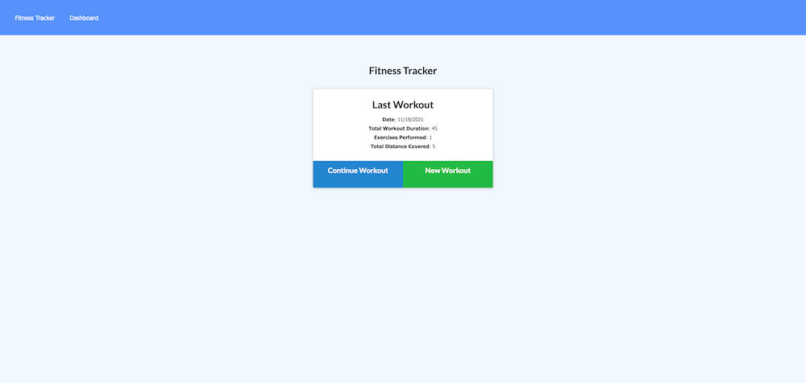
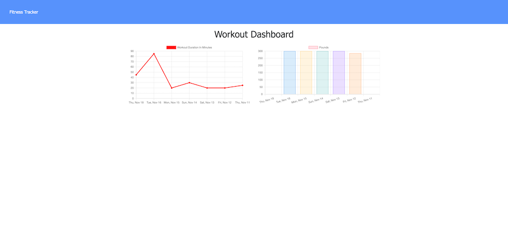

# FitnessTracker | 

# User Story

As a user, I want to be able to view create and track daily workouts. I want to be able to log multiple exercises in a workout on a given day. I should also be able to track the name, type, weight, sets, reps, and duration of exercise. If the exercise is a cardio exercise, I should be able to track my distance traveled.

# Criteria 

When the user loads the page, they should be given the option to create a new workout or continue with their last workout.

The user should be able to:

  * Add exercises to the most recent workout plan.

  * Add new exercises to a new workout plan.

  * View the combined weight of multiple exercises from the past seven workouts on the `stats` page.

  * View the total duration of each workout from the past seven workouts on the `stats` page.

# Screenshot

# Deployed Site

[Link to project repo](https://github.com/mlh19/)

[Link to Heroku](https://the-beast02.herokuapp.com/?id=61959a83bba3582389b5b7b1)

# Other Details

- Used in-class activities and chat resources to complete assignment.

- Additionally, worked with Brooke Jones and Todd Taylor to complete assignemnt.

- Let's Connect on GitHub! [mlh19](https://www.github.com/mlh19)

- Email Me! [ml.hoover@yahoo.com](mailto:ml.hoover@yahoo.com)